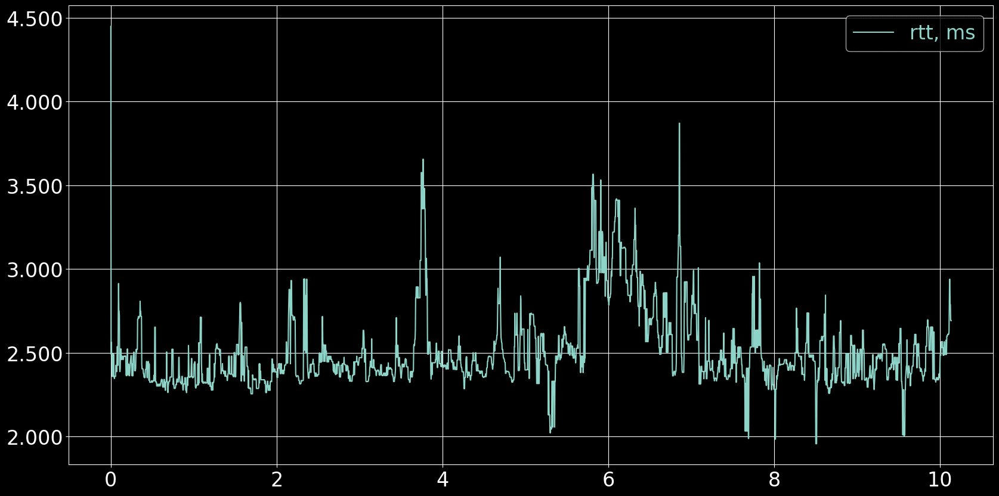
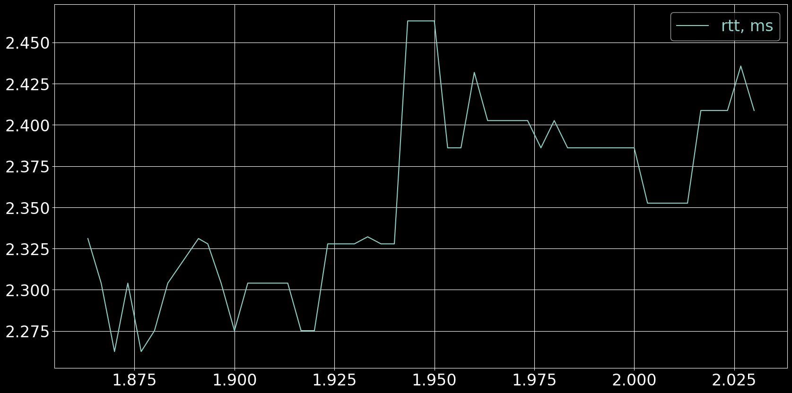
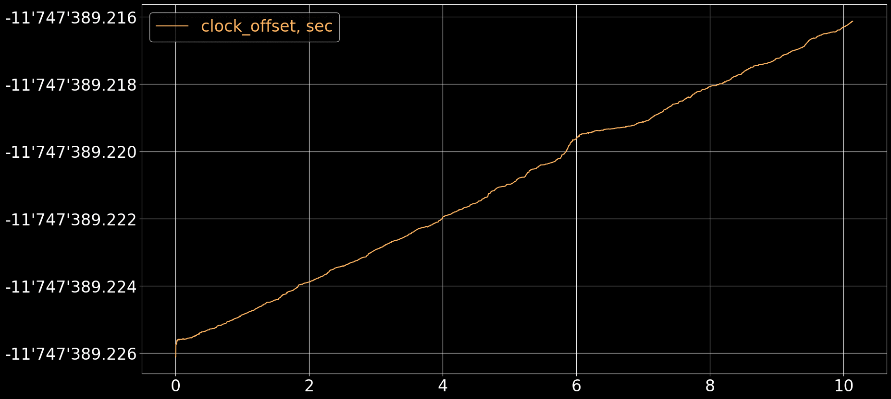
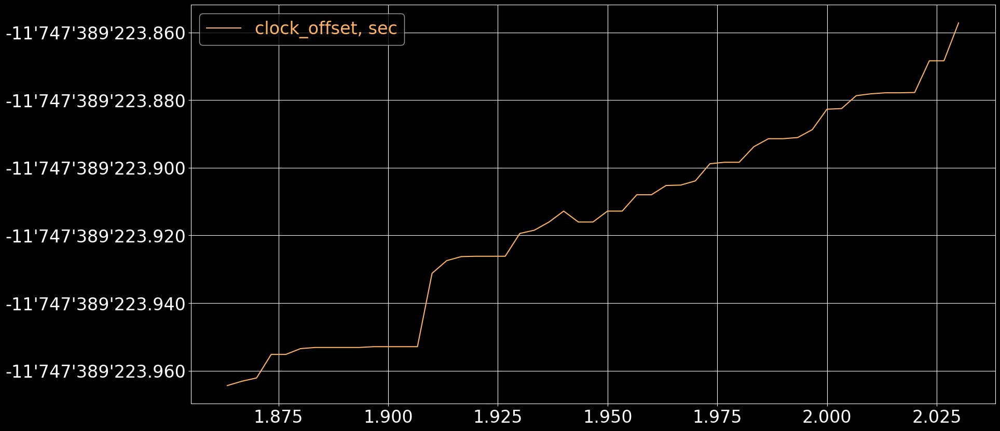

# Table of Contents

1.  [Test summary](#org4cb11df)
2.  [Setup code](#org5cbcb1b)
3.  [Round Trip Time](#org9fcecbb)
4.  [Clock Offset](#org70d0723)


<a id="org4cb11df"></a>

# Test summary


## Environment

-   **Devices**
    -   Sender: RPi4B (`arm32`)
    -   Receiver: PC (`x86_64`)

-   **Network**
    -   Wi-Fi 5GHz

-   **Audio**
    -   input and output are WAV files

-   **Ping**
    -   below 3ms

-   **Scheduling**
    -   `SCHED_RR` disabled


## Info

-   **Git revisions**
    
    ```
    cd ~/dev/roc-streaming/roc-toolkit && git log -1 --format=short
    ```
    
        commit 5e8528929835d8c8844ce3fd020047373488e6ab
        Author: Mikhail Baranov <baranov.mv@gmail.com>
        
            Slot provides Control endpoints ts
    
    ```
    cd ~/dev/roc-streaming/csvplotter && git log -1 --format=short
    ```
    
        commit 1ef0a47962b9071c2cc76175c59179ddf7895d12
        Author: Mikhail Baranov <baranov.mv@gmail.com>
        
            plot t1-t4 stats

-   **Estimate clock offset**
    
    Rough difference between unix time on two machines.
    
    ```
    ssh raspberrypi-4b.lan "date -u +%s" | awk -v local="$(date -u +%s)" '{print local - $1}'
    ```
    
        11747389

-   **Estimate ping**
    
    ```
    ping -c 5 raspberrypi-4b.lan
    ```
    
    ```
    PING raspberrypi-4b.lan (192.168.0.141) 56(84) bytes of data.
    64 bytes from raspberrypi-4b.lan (192.168.0.141): icmp_seq=1 ttl=64 time=3.52 ms
    64 bytes from raspberrypi-4b.lan (192.168.0.141): icmp_seq=2 ttl=64 time=3.45 ms
    64 bytes from raspberrypi-4b.lan (192.168.0.141): icmp_seq=3 ttl=64 time=3.29 ms
    64 bytes from raspberrypi-4b.lan (192.168.0.141): icmp_seq=4 ttl=64 time=1.90 ms
    64 bytes from raspberrypi-4b.lan (192.168.0.141): icmp_seq=5 ttl=64 time=3.40 ms
    
    --- raspberrypi-4b.lan ping statistics ---
    5 packets transmitted, 5 received, 0% packet loss, time 4005ms
    rtt min/avg/max/mdev = 1.898/3.109/3.516/0.610 ms
    ```


## Running

-   **stop ntpd**
    
    ```
    sudo systemctl stop ntp
    ```

-   **run roc-send**
    
    ```
    ./roc-send -vv -s rtp+rs8m://dell-xps15.lan:10001 -r rs8m://dell-xps15.lan:10002 -c rtcp://dell-xps15.lan:10003 -i file:long.wav
    ```

-   **run roc-recv**
    
    ```
    ./roc-recv -vv -s rtp+rs8m://0.0.0.0:10001 -r rs8m://0.0.0.0:10002 -c rtcp://0.0.0.0:10003 -o file:test.wav --dump test.csv
    ```

-   **run csvplotter**
    
    ```
    python3 ./csvplotter.py test.csv
    ```


<a id="org5cbcb1b"></a>

# Setup code

<details>
  <summary>Click to expand</summary>

</details>

```python
data = load_csv('01_wifi5ghz_rpi_pc.csv')
```


<a id="org9fcecbb"></a>

# Round Trip Time


## Overall

```python
plt.plot(data[:,0]/60, data[:,1]*1000)
plt.legend(['rtt, ms'], labelcolor='linecolor')
configure_plot()
```




## Zoomed

```python
plt.plot(data[550:600,0]/60, data[550:600,1]*1000)
plt.legend(['rtt, ms'], labelcolor='linecolor')
configure_plot()
```




## Statistics

```python
format_tables(stats_table('rtt', data[:,1]),
              jitter_table('rtt_jitter', data[:,1]))
```

|         | **`rtt`** | **`rtt_jitter`** |
|------- |--------- |---------------- |
| **min** | 1.957 ms  | 0.000 ms         |
| **max** | 4.449 ms  | 2.028 ms         |
| **avg** | 2.509 ms  | 0.068 ms         |
| **p95** | 2.994 ms  | 0.269 ms         |


<a id="org70d0723"></a>

# Clock Offset


## Overall

```python
plt.plot(data[:,0]/60, data[:,2], 'C5')
plt.legend(['clock_offset, sec'], labelcolor='linecolor')
configure_plot()
```




## Zoomed

```python
plt.plot(data[550:600,0]/60, data[550:600,2]*1000, 'C5')
plt.legend(['clock_offset, sec'], labelcolor='linecolor')
configure_plot()
```




## Statistics

```python
format_tables(jitter_table('clock_offset_jitter', data[:,2]))
```

|         | **`clock_offset_jitter`** |
|------- |------------------------- |
| **min** | 0.000 ms                  |
| **max** | 0.376 ms                  |
| **avg** | 0.005 ms                  |
| **p95** | 0.017 ms                  |

```python
format_tables(drift_table('clock_offset_drift', data[:,0], data[:,2]))
```

|             | **`clock_offset_drift`** |
|----------- |------------------------ |
| **sec/sec** | 0.000016                 |
| **sec/day** | 1.418                    |
