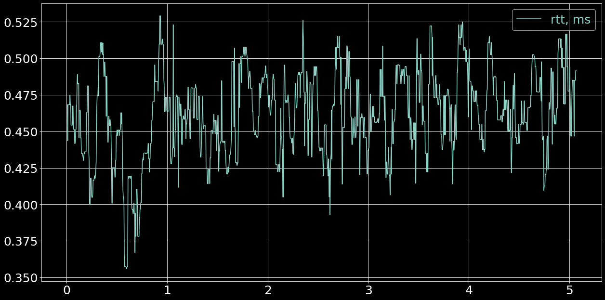
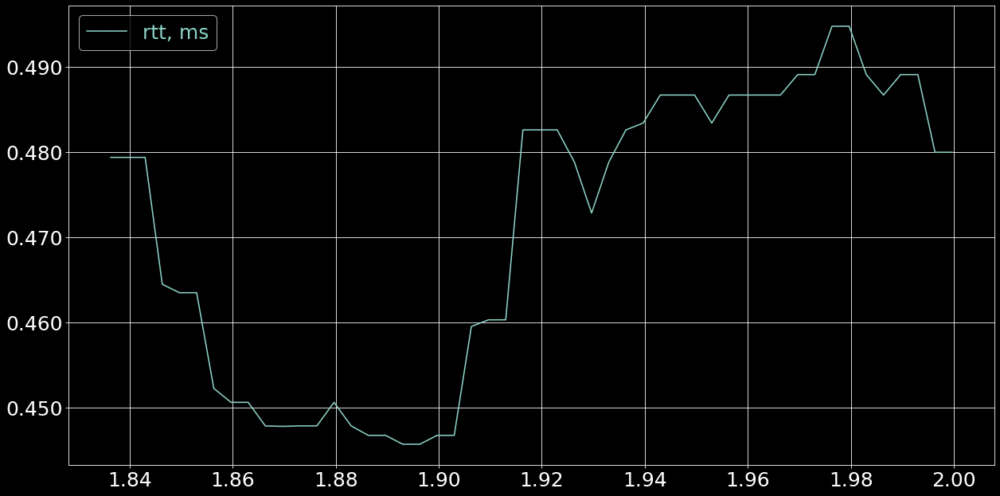
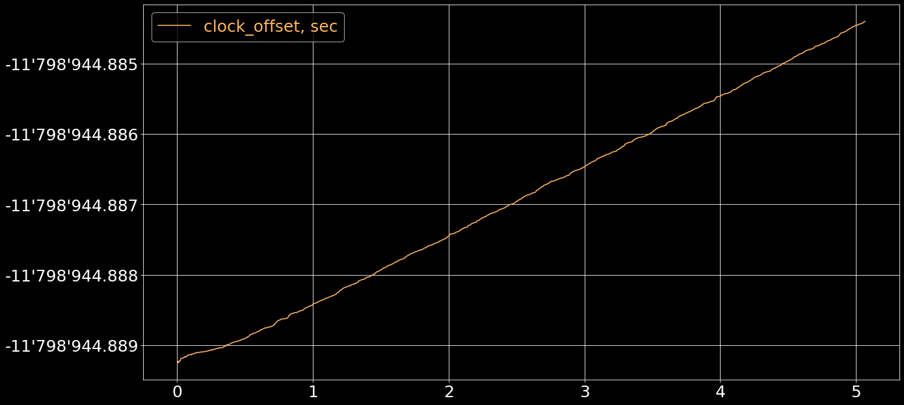
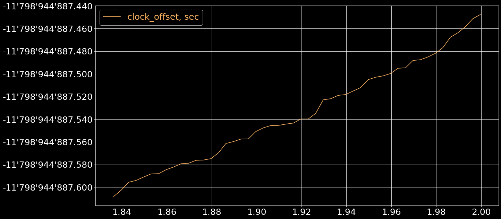

# `03--ethernet--no_load`


# Table of Contents

1.  [Test summary](#org23f93c7)
2.  [Setup code](#orgff6366e)
3.  [Round Trip Time](#org2449cb1)
4.  [Clock Offset](#org97dc6e7)


# Test summary


## Environment

-   **Devices**
    -   Sender: RPi4B (`arm32`)
    -   Receiver: PC (`x86_64`)

-   **Network**
    -   Ethernet (direct connection)

-   **Audio**
    -   input and output are WAV files

-   **Ping**
    -   below 0.3ms

-   **Scheduling**
    -   `SCHED_RR` disabled


## Info

-   **Git revisions**
    
    ```shell
    cd ~/dev/roc-streaming/roc-toolkit && git log -1 --format=short
    ```
    
        commit 5e8528929835d8c8844ce3fd020047373488e6ab
        Author: Mikhail Baranov <baranov.mv@gmail.com>
        
            Slot provides Control endpoints ts
    
    ```shell
    cd ~/dev/roc-streaming/csvplotter && git log -1 --format=short
    ```
    
        commit 1ef0a47962b9071c2cc76175c59179ddf7895d12
        Author: Mikhail Baranov <baranov.mv@gmail.com>
        
            plot t1-t4 stats

-   **Estimate clock offset**
    
    Rough difference between unix time on two machines.
    
    ```shell
    ssh raspberrypi-4b.eth "date -u +%s" | awk -v local="$(date -u +%s)" '{print local - $1}'
    ```
    
        11798932

-   **Estimate ping**
    
    ```shell
    ping -q -i 0.002 -c 1000 raspberrypi-4b.eth
    ```
    
        PING raspberrypi-4b.eth (192.168.2.131) 56(84) bytes of data.
        
        --- raspberrypi-4b.eth ping statistics ---
        1000 packets transmitted, 1000 received, 0% packet loss, time 1996ms
        rtt min/avg/max/mdev = 0.119/0.149/0.250/0.025 ms


## Running

-   **stop ntpd**
    
    ```
    sudo systemctl stop ntp
    ```

-   **run roc-send**
    
    ```
    ./roc-send -vv -s rtp+rs8m://dell-xps15.eth:10001 -r rs8m://dell-xps15.eth:10002 -c rtcp://dell-xps15.eth:10003 -i file:long.wav
    ```

-   **run roc-recv**
    
    ```
    ./roc-recv -vv -s rtp+rs8m://0.0.0.0:10001 -r rs8m://0.0.0.0:10002 -c rtcp://0.0.0.0:10003 -o file:test.wav --dump test.csv
    ```

-   **run csvplotter**
    
    ```
    python3 ./csvplotter.py test.csv
    ```


# Setup code

<details>
  <summary>Click to expand</summary>

```python
%matplotlib inline
import matplotlib.pyplot as plt
import matplotlib.ticker as ticker
import numpy as np
import pandas as pd
import os
import subprocess

plt.rcParams['figure.figsize'] = [20, 10]
plt.rcParams['figure.dpi'] = 75
plt.rcParams.update({'font.size': 24})
plt.style.use(['dark_background'])

def load_csv(path):
  if os.path.exists(path):
    iterator = open(path)
  else:
    iterator = (line.decode('utf-8') for line in
                subprocess.Popen(['xz', '-dc', f'{path}.xz'],
                                 stdout=subprocess.PIPE).stdout)

  lines = []
  for line in iterator:
    if not line.startswith('r,'):
      continue
    lines.append(line.replace('r,', '').strip())

  data = np.genfromtxt(lines, dtype=float, delimiter=',')
  data[:,0] /= 1e9
  data[:,0] -= data[0,0]
  for n in range(1, data.shape[1]):
    data[:,n] /= 1e9

  return data

def configure_plot():
  ax = plt.gca()
  ax.grid(True)
  ax.ticklabel_format(useOffset=False, style='plain')
  ax.get_yaxis().set_major_formatter(ticker.FuncFormatter(
    lambda x, pos: "{:,.3f}".format(x).replace(",", "'")))

def stats_table(name, values):
  values = values * 1000
  return pd.DataFrame({
    '': [f'*={name}=*'],
    '*min*': ['{:.3f} ms'.format(np.min(values))],
    '*max*': ['{:.3f} ms'.format(np.max(values))],
    '*avg*': ['{:.3f} ms'.format(np.mean(values))],
    '*p95*': ['{:.3f} ms'.format(np.percentile(values, 95))],
  })

def jitter_table(name, values):
  values_jitter = np.abs(np.diff(np.diff(values)))
  return stats_table(name, values_jitter)

def drift_table(name, tstamps, values):
  tstamp_delta = tstamps[-1] - tstamps[0]
  values_delta = values[-1] - values[0]
  values_drift = values_delta / tstamp_delta
  return pd.DataFrame({
    '': [f'*={name}=*'],
    '*sec/sec*': '{:.6f}'.format(values_drift),
    '*sec/day*': '{:.3f}'.format(values_drift*60*60*24),
  })

def format_tables(*tables):
  res = pd.concat(tables).T.reset_index()
  tbl = res.values.tolist()
  return [tbl[0]] + [None] + tbl[1:]
```

</details>

```python
data = load_csv('03--ethernet--no_load.csv')
data = data[1:,]
```


# Round Trip Time


## Overall

```python
plt.plot(data[:,0]/60, data[:,1]*1000)
plt.legend(['rtt, ms'], labelcolor='linecolor')
configure_plot()
```




## Zoomed

```python
plt.plot(data[550:600,0]/60, data[550:600,1]*1000)
plt.legend(['rtt, ms'], labelcolor='linecolor')
configure_plot()
```




## Statistics

```python
format_tables(stats_table('rtt', data[:,1]),
              jitter_table('rtt_jitter', data[:,1]))
```

|         | **`rtt`** | **`rtt_jitter`** |
|------- |--------- |---------------- |
| **min** | 0.356 ms  | 0.000 ms         |
| **max** | 0.529 ms  | 0.169 ms         |
| **avg** | 0.462 ms  | 0.010 ms         |
| **p95** | 0.508 ms  | 0.037 ms         |


# Clock Offset


## Overall

```python
plt.plot(data[:,0]/60, data[:,2], 'C5')
plt.legend(['clock_offset, sec'], labelcolor='linecolor')
configure_plot()
```




## Zoomed

```python
plt.plot(data[550:600,0]/60, data[550:600,2]*1000, 'C5')
plt.legend(['clock_offset, sec'], labelcolor='linecolor')
configure_plot()
```




## Statistics

```python
format_tables(jitter_table('clock_offset_jitter', data[:,2]))
```

|         | **`clock_offset_jitter`** |
|------- |------------------------- |
| **min** | 0.000 ms                  |
| **max** | 0.038 ms                  |
| **avg** | 0.003 ms                  |
| **p95** | 0.010 ms                  |

```python
format_tables(drift_table('clock_offset_drift', data[:,0], data[:,2]))
```

|             | **`clock_offset_drift`** |
|----------- |------------------------ |
| **sec/sec** | 0.000016                 |
| **sec/day** | 1.378                    |
