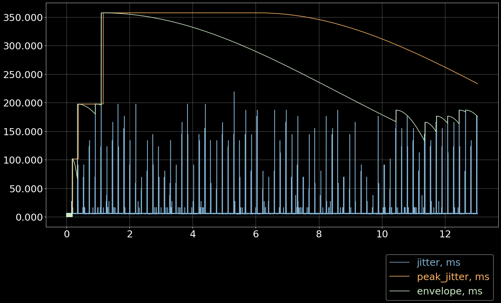
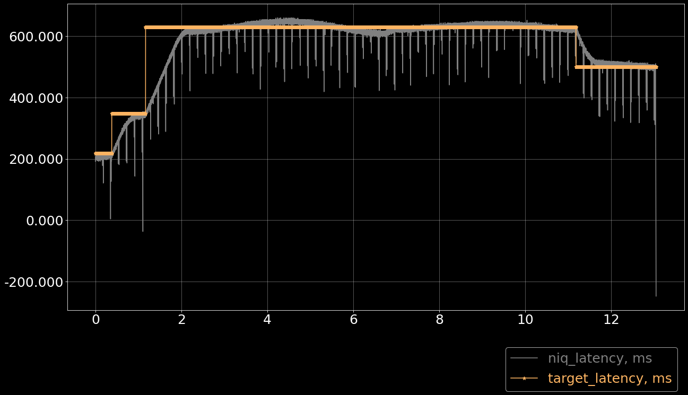
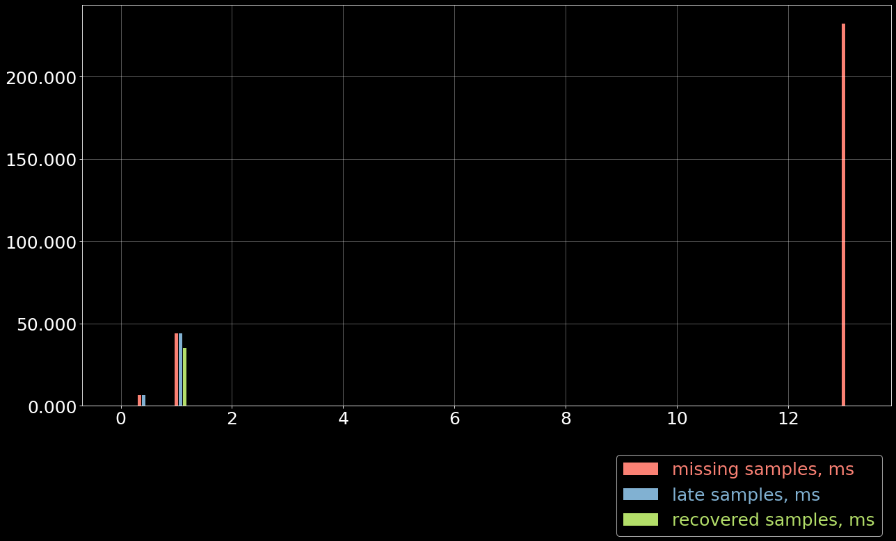

# TEST `01--5ghz--no_load`

**Table of contents:**

-   [Test summary](#test-summary)
-   [Test bench](#test-bench)
-   [Library code](#library-code)
-   [Jitter Meter](#jitter-meter)
-   [Latency Tuner](#latency-tuner)
-   [Depacketizer](#depacketizer)

# Test summary

**Test group:** `20250210_gh712_peak_jitter` Testing peak jitter
calculation.

**Test:** `01--5ghz--no_load` 5GHz Wi-Fi link, no external load.

**Date:**

Thu 13 Feb 2025

**Artifacts:**

| **name**      | **link**                             |
|---------------|--------------------------------------|
| receiver dump | [`roc_recv.csv.xz`](roc_recv.csv.xz) |
| receiver log  | [`roc_recv.log.xz`](roc_recv.log.xz) |

**Jupyter notebook:**

[`report.ipynb`](report.ipynb)

# Test bench

## Hardware info

-   **Network**

    -   Wi-Fi 5GHz
    -   1 sender connected to 1 receiver via AP

-   **Devices**

    | Role     | Model          | Hostname             | Arch      |
    |----------|----------------|----------------------|-----------|
    | sender   | OrangePi Lite2 | `orangepi-lite2.lan` | `aarch64` |
    | receiver | PC             | `dell-xps15.lan`     | `x86_64`  |

## Software info

-   **git revisions**

    ``` shell
    cd roc-toolkit && git log -1 --format=short
    ```

    ``` example
    # OUTPUT:
    commit a02a89458df136c7dc7585e1f25a7ae1a722afd3
    Author: Victor Gaydov <victor@enise.org>

        scripts: Fixes in rgh.py
    ```

    ``` shell
    cd csvplotter && git log -1 --format=short
    ```

    ``` example
    # OUTPUT:
    commit 76e75481d818663166396b03ccc39687fd0a2d1a
    Author: Victor Gaydov <victor@enise.org>

        Add DepacketizerPlotter
    ```

-   **roc-toolkit version**

    ``` shell
    roc-recv --version
    ```

    ``` example
    # OUTPUT:
    roc-recv 0.4.0 (b2798abb92)
    ```

    ``` shell
    ssh orangepi-lite2.lan ./roc/roc-send --version
    ```

    ``` example
    # OUTPUT:
    roc-send 0.4.0 (b2798abb92)
    ```

## Configuration

Sender streams to receiver during ~13 minutes.

Protocols:

| Endpoint | Protocol      |
|----------|---------------|
| source   | `rtp+rs8m://` |
| repair   | `rs8m://`     |
| control  | `rtcp://`     |

Sender options:

| Option              | Value   |
|---------------------|---------|
| `--packet-encoding` | pcm@s16 |
| `--packet-len`      | 5 ms    |
| `--fec-encoding`    | rs8m    |
| `--fec-block-src`   | 18      |
| `--fec-block-rpr`   | 10      |

Receiver options:

| Option                  | Value    |
|-------------------------|----------|
| `--plc`                 | none     |
| `--resampler-backend`   | builtin  |
| `--resampler-profile`   | medium   |
| `--target-latency`      | adaptive |
| `--latency-tolerance`   | 200 ms   |
| `--start-latency`       | 200 ms   |
| `--min-latency`         | 15 ms    |
| `--max-latency`         | 1000 ms  |
| `--latency-backend`     | niq      |
| `--latency-profile`     | gradual  |
| `--no-play-timeout`     | 266 ms   |
| `--choppy-play-timeout` | 2000 ms  |

## Instructions

-   **run roc-send**

    On sender (`orangepi-lite2.lan`):

    ``` example
    ./roc/roc-send -vv -s rtp+rs8m://dell-xps15.lan:10001 -r rs8m://dell-xps15.lan:10002 -c rtcp://dell-xps15.lan:10003 -i file:long.wav
    ```

-   **run roc-recv**

    On receiver (`dell-xps15.lan`):

    ``` example
    reclog -o roc_recv.log roc-recv -vv -s rtp+rs8m://0.0.0.0:10001 -r rs8m://0.0.0.0:10002 -c rtcp://0.0.0.0:10003 --dump roc_recv.csv
    ```

-   **run csvplotter**

    On receiver (`dell-xps15.lan`):

    ``` example
    csvplotter.py roc_recv.csv
    ```

## Precheck

-   **ping**

    ``` shell
    ping -q -i 0.002 -c 1000 orangepi-lite2.lan
    ```

    ``` example
    # OUTPUT:
    PING orangepi-lite2.lan (192.168.0.140) 56(84) bytes of data.

    --- orangepi-lite2.lan ping statistics ---
    1000 packets transmitted, 1000 received, 0% packet loss, time 9842ms
    rtt min/avg/max/mdev = 1.457/10.535/76.990/5.364 ms, pipe 8
    ```

# Library code

<details>
  <summary>Click to expand</summary>

``` python
# -*- coding: utf-8; tab-width: 2 -*-
import matplotlib.pyplot as plt
import matplotlib.ticker as ticker
import numpy as np
import pandas as pd
import os
import subprocess

plt.rcParams['figure.figsize'] = [20, 10]
plt.rcParams['figure.dpi'] = 75
plt.rcParams.update({'font.size': 24})
plt.style.use(['dark_background'])

def load_csv(path, lstrip=1, rstrip=1):
  if os.path.exists(path):
    iterator = open(path)
  else:
    iterator = (line.decode('utf-8') for line in
                subprocess.Popen(['xz', '-dc', f'{path}.xz'],
                                 stdout=subprocess.PIPE).stdout)

  contents = {}
  for line in iterator:
    key = line[0]
    if not key in contents:
      contents[key] = []
    contents[key].append(line[2:].rstrip())

  data = {}
  for key, lines in contents.items():
    if lstrip:
      lines = lines[lstrip:]
    if rstrip:
      lines = lines[:-rstrip]
    mat = np.genfromtxt(lines, dtype=float, delimiter=',')
    mat[:,0] /= 1e9
    mat[:,0] -= mat[0,0]
    data[key] = mat

  return data

def configure_plot():
  ax = plt.gca()
  ax.grid(True, alpha=0.4)
  ax.ticklabel_format(useOffset=False, style='plain')
  ax.get_yaxis().set_major_formatter(ticker.FuncFormatter(
    lambda x, pos: "{:,.3f}".format(x).replace(",", "'")))

def plot_bars(x, y, bottom=None, offset=None, step=20/60, width=None, *args, **kw):
  if not width:
    width = step / 5

  xc = np.arange(x[0], x[-1], step)
  yc = np.zeros_like(xc)

  for i in range(len(xc)):
    yc[i] = np.sum(y[np.where((x >= xc[i]) & (x < xc[i] + step))])

  if offset is not None:
    xc += offset * width * 1.15
  if bottom is not None:
    yc += bottom

  plt.bar(xc, yc, bottom=bottom, width=width, *args, **kw)

  # can be used as bottom for another plot
  return yc

def in_notebook():
  for var in ['JPY_PARENT_PID', 'JUPYTERLAB_PATH']:
    if var in os.environ:
      return True
  return False

def hdr(s):
  s = s.replace('_', '-')
  if in_notebook():
    return s
  else:
    return f'*{s}*'

def stats_table(name, values):
  return pd.DataFrame({
    '': [hdr(name)],
    hdr('min'): ['{:.3f} ms'.format(np.min(values))],
    hdr('max'): ['{:.3f} ms'.format(np.max(values))],
    hdr('avg'): ['{:.3f} ms'.format(np.mean(values))],
    hdr('p95'): ['{:.3f} ms'.format(np.percentile(values, 95))],
  })

def jitter_table(name, values):
  values_jitter = np.abs(np.diff(np.diff(values)))
  return stats_table(name, values_jitter)

def drift_table(name, tstamps, values):
  tstamp_delta = tstamps[-1] - tstamps[0]
  values_delta = values[-1] - values[0]
  values_drift = values_delta / tstamp_delta
  return pd.DataFrame({
    '': [hdr(name)],
    hdr('sec/sec'): '{:.6f}'.format(values_drift),
    hdr('sec/day'): '{:.3f}'.format(values_drift*60*60*24),
  })

def format_tables(*tables):
  res = pd.concat(tables)
  if in_notebook():
    res.index = res.iloc[:,0].tolist()
    res = res.iloc[:, 1:]
    res = res.T
    return res
  else:
    res = res.T
    res = res.reset_index()
    tbl = res.values.tolist()
    return [tbl[0]] + [None] + tbl[1:]
```

</details>

``` python
data = load_csv('roc_recv.csv')
data.keys()
```

``` example
dict_keys(['m', 'd', 't', 'f'])
```

# Jitter Meter

## Plot

``` python
plt.plot(data['m'][:,0]/60, data['m'][:,2], 'C4')
plt.plot(data['m'][:,0]/60, data['m'][:,3]/1e6, 'C5')
plt.plot(data['m'][:,0]/60, data['m'][:,4]/1e6, 'C8')
plt.legend(['jitter, ms', 'peak_jitter, ms', 'envelope, ms'],
           labelcolor='linecolor', bbox_to_anchor=(1, -0.1))
configure_plot()
```



## Statistics

``` python
format_tables(stats_table('jitter', data['m'][:,2]),
              stats_table('peak-jitter', data['m'][:,3]/1e6))
```

|         | **jitter** | **peak-jitter** |
|---------|------------|-----------------|
| **min** | 3.211 ms   | 5.010 ms        |
| **max** | 357.303 ms | 357.289 ms      |
| **avg** | 5.890 ms   | 314.763 ms      |
| **p95** | 5.845 ms   | 357.289 ms      |

# Latency Tuner

## Plot

``` python
plt.plot(data['t'][:,0]/60, data['t'][:,1]/44100*1e3, 'gray')
plt.plot(data['t'][:,0]/60, data['t'][:,2]/44100*1e3, 'C5*-')
plt.legend(['niq_latency, ms', 'target_latency, ms'],
           labelcolor='linecolor', bbox_to_anchor=(1, -0.1))
configure_plot()
```



## Statistics

``` python
format_tables(stats_table('niq-latency', data['t'][:,1]/44100*1e3),
              stats_table('target-latency', data['t'][:,2]/44100*1e3))
```

|         | **niq-latency** | **target-latency** |
|---------|-----------------|--------------------|
| **min** | -247.755 ms     | 217.687 ms         |
| **max** | 659.977 ms      | 630.000 ms         |
| **avg** | 573.402 ms      | 583.273 ms         |
| **p95** | 649.388 ms      | 630.000 ms         |

# Depacketizer

## Plot

``` python
plot_bars(data['d'][:-1,0]/60, np.diff(data['d'][:,1]/44100*1e3), offset=0, color='C3')
plot_bars(data['d'][:-1,0]/60, np.diff(data['d'][:,2]/44100*1e3), offset=1, color='C4')
plot_bars(data['d'][:-1,0]/60, np.diff(data['d'][:,3]/44100*1e3), offset=2, color='C6')
plt.legend(['missing samples, ms', 'late samples, ms', 'recovered samples, ms'],
           labelcolor='linecolor', bbox_to_anchor=(1, -0.1))
configure_plot()
```


