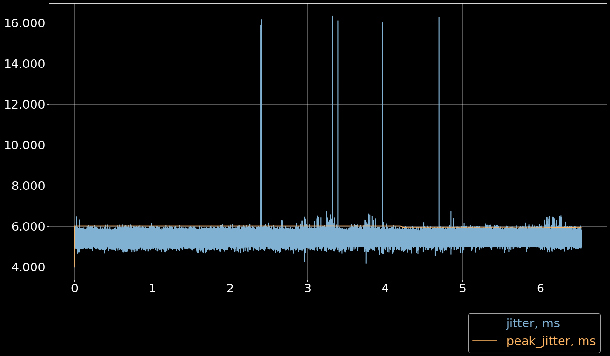
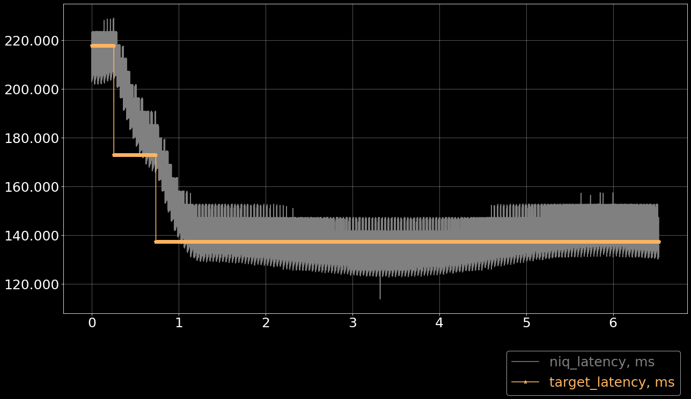
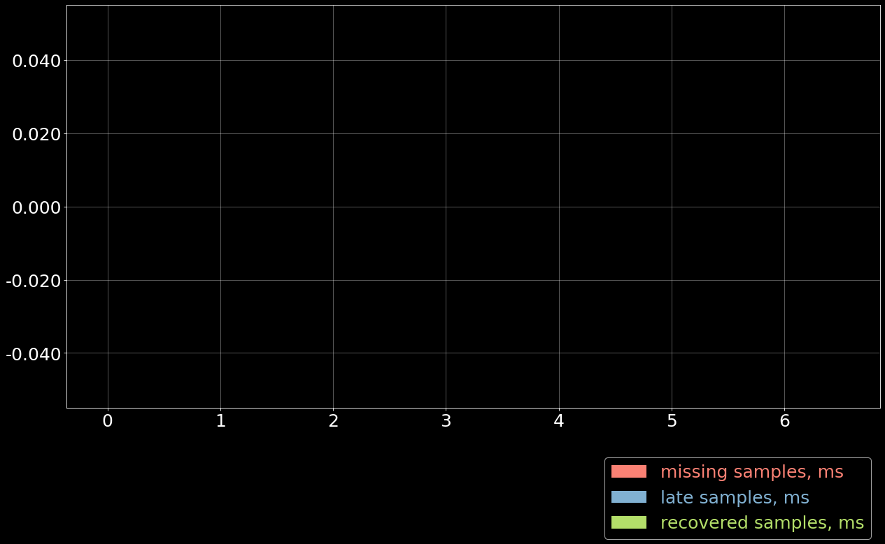
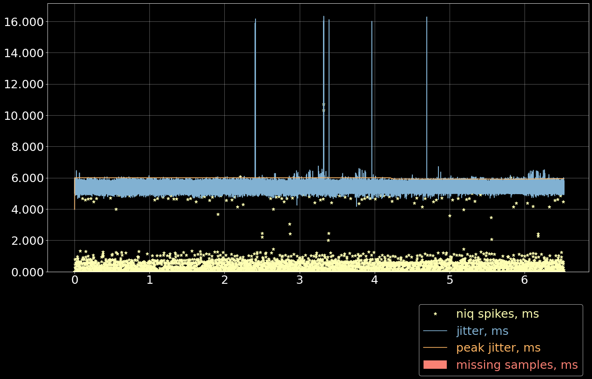

# TEST `07--ether--spikes`

**Table of contents:**

-   [Test summary](#test-summary)
-   [Test bench](#test-bench)
-   [Library code](#library-code)
-   [Jitter Meter](#jitter-meter)
-   [Latency Tuner](#latency-tuner)
-   [Depacketizer](#depacketizer)
-   [Jitter + Niq + Losses](#jitter--niq--losses)

# Test summary

**Test group:** `20250210_gh712_peak_jitter` Testing peak jitter
calculation.

**Test:** `07--ether--spikes` Ethernet, short simulated load spikes.

**Date:**

Sat 15 Feb 2025

**Artifacts:**

| **name**      | **link**                             |
|---------------|--------------------------------------|
| receiver dump | [`roc_recv.csv.xz`](roc_recv.csv.xz) |
| receiver log  | [`roc_recv.log.xz`](roc_recv.log.xz) |

**Jupyter notebook:**

[`README.ipynb`](README.ipynb)

# Test bench

## Hardware info

-   **Network**

    -   Ethernet
    -   1 sender connected to 1 receiver via cable directly

-   **Devices**

    | Role     | Model           | Hostname                    | Arch      |
    |----------|-----------------|-----------------------------|-----------|
    | sender   | Raspberry Pi 4B | `raspberrypi-4b-ubuntu.eth` | `aarch64` |
    | receiver | PC              | `dell-xps15.lan`            | `x86_64`  |

## Software info

-   **git revisions**

    ``` shell
    cd roc-toolkit && git log -1 --format=short
    ```

    ``` example
    # OUTPUT:
    commit 62100a71dc06c20b94304110e6d228083fdd8125
    Author: Victor Gaydov <victor@enise.org>

        chore: Use nanoseconds for all jitter entries in dump
    ```

    ``` shell
    cd csvplotter && git log -1 --format=short
    ```

    ``` example
    # OUTPUT:
    commit e8afcd190cda52198cc13a89cad7479e2ae5bba6
    Author: Victor Gaydov <victor@enise.org>

        "Decimation"
    ```

-   **roc-toolkit version**

    ``` shell
    roc-recv --version
    ```

    ``` example
    # OUTPUT:
    roc-recv 0.4.0 (f725325e26)
    ```

    ``` shell
    ssh ubuntu@raspberrypi-4b-ubuntu.eth ./roc/roc-send --version
    ```

    ``` example
    # OUTPUT:
    roc-send 0.4.0 (f725325e26)
    ```

## Configuration

Sender streams to receiver during ~6 minutes.

Protocols:

| Endpoint | Protocol      |
|----------|---------------|
| source   | `rtp+rs8m://` |
| repair   | `rs8m://`     |
| control  | `rtcp://`     |

Sender options:

| Option              | Value   |
|---------------------|---------|
| `--packet-encoding` | pcm@s16 |
| `--packet-len`      | 5 ms    |
| `--fec-encoding`    | rs8m    |
| `--fec-block-src`   | 18      |
| `--fec-block-rpr`   | 10      |

Receiver options:

| Option                  | Value    |
|-------------------------|----------|
| `--plc`                 | none     |
| `--resampler-backend`   | builtin  |
| `--resampler-profile`   | medium   |
| `--target-latency`      | adaptive |
| `--latency-tolerance`   | 200 ms   |
| `--start-latency`       | 200 ms   |
| `--min-latency`         | 15 ms    |
| `--max-latency`         | 1000 ms  |
| `--latency-backend`     | niq      |
| `--latency-profile`     | gradual  |
| `--no-play-timeout`     | 266 ms   |
| `--choppy-play-timeout` | 2000 ms  |

## Instructions

-   **run roc-send**

    On sender (`raspberrypi-4b-ubuntu.eth`):

    ``` example
    ./roc/roc-send -vv -s rtp+rs8m://dell-xps15.eth:10001 -r rs8m://dell-xps15.eth:10002 -c rtcp://dell-xps15.eth:10003 -i file:long.wav
    ```

-   **run roc-recv**

    On receiver (`dell-xps15.lan`):

    ``` example
    reclog -o roc_recv.log roc-recv -vv -s rtp+rs8m://0.0.0.0:10001 -r rs8m://0.0.0.0:10002 -c rtcp://0.0.0.0:10003 --plc beep --dump roc_recv.csv
    ```

-   **generating load**

    On receiver (`dell-xps15.lan`):

    ``` example
    ssh ubuntu@raspberrypi-4b-ubuntu.eth cat /dev/random > /dev/null
    ```

    We run this from time to time during the benchmark, from 0 to 4
    streams simultaneously. When there were many parallel instances, you
    can see high jitter spikes on the plot.

-   **run csvplotter**

    On receiver (`dell-xps15.lan`):

    ``` example
    csvplotter.py roc_recv.csv
    ```

## Precheck

-   **ping**

    ``` shell
    ping -q -i 0.002 -c 1000 raspberrypi-4b-ubuntu.eth
    ```

    ``` example
    # OUTPUT:
    PING raspberrypi-4b-ubuntu.eth (192.168.3.142) 56(84) bytes of data.

    --- raspberrypi-4b-ubuntu.eth ping statistics ---
    1000 packets transmitted, 1000 received, 0% packet loss, time 1996ms
    rtt min/avg/max/mdev = 0.113/0.134/0.274/0.019 ms
    ```

# Library code

<details>
  <summary>Click to expand</summary>

``` python
# -*- coding: utf-8; tab-width: 2 -*-
import matplotlib.pyplot as plt
import matplotlib.ticker as ticker
import numpy as np
import pandas as pd
import os
import subprocess

plt.rcParams['figure.figsize'] = [20, 10]
plt.rcParams['figure.dpi'] = 75
plt.rcParams.update({'font.size': 24})
plt.style.use(['dark_background'])

def load_csv(path, lstrip=1, rstrip=1):
  if os.path.exists(path):
    iterator = open(path)
  else:
    iterator = (line.decode('utf-8') for line in
                subprocess.Popen(['xz', '-dc', f'{path}.xz'],
                                 stdout=subprocess.PIPE).stdout)

  contents = {}
  for line in iterator:
    key = line[0]
    if not key in contents:
      contents[key] = []
    contents[key].append(line[2:].rstrip())

  data = {}
  for key, lines in contents.items():
    if lstrip:
      lines = lines[lstrip:]
    if rstrip:
      lines = lines[:-rstrip]
    mat = np.genfromtxt(lines, dtype=float, delimiter=',')
    mat[:,0] /= 1e9
    mat[:,0] -= mat[0,0]
    data[key] = mat

  return data

def configure_plot():
  ax = plt.gca()
  ax.grid(True, alpha=0.4)
  ax.ticklabel_format(useOffset=False, style='plain')
  ax.get_yaxis().set_major_formatter(ticker.FuncFormatter(
    lambda x, pos: "{:,.3f}".format(x).replace(",", "'")))

def plot_bars(x, y, bottom=None, offset=None, step=20/60, width=None, *args, **kw):
  if not width:
    width = step / 5

  xc = np.arange(x[0], x[-1], step)
  yc = np.zeros_like(xc)

  for i in range(len(xc)):
    yc[i] = np.sum(y[np.where((x >= xc[i]) & (x < xc[i] + step))])

  if offset is not None:
    xc += offset * width * 1.15
  if bottom is not None:
    yc += bottom

  plt.bar(xc, yc, bottom=bottom, width=width, *args, **kw)

  # can be used as bottom for another plot
  return yc

def plot_pie(sizes, labels=[], colors=[], autopct='%1.0f%%', *args, **kw):
  n = 0
  while n < len(sizes):
    if sizes[n] == 0:
      del sizes[n]
      if labels:
        del labels[n]
      if colors:
        del colors[n]
    else:
      n += 1

  plt.figure(dpi=200)
  plt.subplots_adjust(top=0.6, bottom=0.4)

  patches, texts, autotexts = plt.pie(
    sizes, labels=labels, colors=colors, textprops={'fontsize': 14},
    autopct=autopct, *args, **kw)
  for text in texts:
    text.set_color('white')
  for autotext in autotexts:
    autotext.set_color('black')

def in_notebook():
  for var in ['JPY_PARENT_PID', 'JUPYTERLAB_PATH']:
    if var in os.environ:
      return True
  return False

def hdr(s):
  s = s.replace('_', '-')
  if in_notebook():
    return s
  else:
    return f'*{s}*'

def stats_table(name, values):
  return pd.DataFrame({
    '': [hdr(name)],
    hdr('min'): ['{:.3f} ms'.format(np.min(values))],
    hdr('max'): ['{:.3f} ms'.format(np.max(values))],
    hdr('avg'): ['{:.3f} ms'.format(np.mean(values))],
    hdr('p95'): ['{:.3f} ms'.format(np.percentile(values, 95))],
  })

def jitter_table(name, values):
  values_jitter = np.abs(np.diff(np.diff(values)))
  return stats_table(name, values_jitter)

def drift_table(name, tstamps, values):
  tstamp_delta = tstamps[-1] - tstamps[0]
  values_delta = values[-1] - values[0]
  values_drift = values_delta / tstamp_delta
  return pd.DataFrame({
    '': [hdr(name)],
    hdr('sec/sec'): '{:.6f}'.format(values_drift),
    hdr('sec/day'): '{:.3f}'.format(values_drift*60*60*24),
  })

def format_tables(*tables):
  res = pd.concat(tables)
  if in_notebook():
    res.index = res.iloc[:,0].tolist()
    res = res.iloc[:, 1:]
    res = res.T
    return res
  else:
    res = res.T
    res = res.reset_index()
    tbl = res.values.tolist()
    return [tbl[0]] + [None] + tbl[1:]
```

</details>

``` python
data = load_csv('roc_recv.csv')
data.keys()
```

``` example
dict_keys(['m', 'd', 't', 'f'])
```

# Jitter Meter

## Plot

``` python
plt.plot(data['m'][:,0]/60, data['m'][:,2]/1e6, 'C4')
plt.plot(data['m'][:,0]/60, data['m'][:,3]/1e6, 'C5')
plt.legend(['jitter, ms', 'peak_jitter, ms', 'envelope, ms'],
           labelcolor='linecolor', bbox_to_anchor=(1, -0.1))
configure_plot()
```



## Statistics

``` python
format_tables(stats_table('jitter', data['m'][:,2]/1e6),
              stats_table('peak-jitter', data['m'][:,3]/1e6))
```

|         | **jitter** | **peak-jitter** |
|---------|------------|-----------------|
| **min** | 3.978 ms   | 3.978 ms        |
| **max** | 16.334 ms  | 6.004 ms        |
| **avg** | 5.304 ms   | 5.974 ms        |
| **p95** | 5.799 ms   | 6.004 ms        |

# Latency Tuner

## Plot

``` python
plt.plot(data['t'][:,0]/60, data['t'][:,1]/44100*1e3, 'gray')
plt.plot(data['t'][:,0]/60, data['t'][:,2]/44100*1e3, 'C5*-')
plt.legend(['niq_latency, ms', 'target_latency, ms'],
           labelcolor='linecolor', bbox_to_anchor=(1, -0.1))
configure_plot()
```



## Statistics

``` python
format_tables(stats_table('niq-latency', data['t'][:,1]/44100*1e3),
              stats_table('target-latency', data['t'][:,2]/44100*1e3))
```

|         | **niq-latency** | **target-latency** |
|---------|-----------------|--------------------|
| **min** | 113.696 ms      | 137.279 ms         |
| **max** | 229.070 ms      | 217.687 ms         |
| **avg** | 145.013 ms      | 143.005 ms         |
| **p95** | 204.862 ms      | 172.880 ms         |

# Depacketizer

## Plot

``` python
plot_bars(data['d'][:-1,0]/60, np.diff(data['d'][:,1]/44100*1e3), offset=0, color='C3')
plot_bars(data['d'][:-1,0]/60, np.diff(data['d'][:,2]/44100*1e3), offset=1, color='C4')
plot_bars(data['d'][:-1,0]/60, np.diff(data['d'][:,3]/44100*1e3), offset=2, color='C6')
plt.legend(['missing samples, ms', 'late samples, ms', 'recovered samples, ms'],
           labelcolor='linecolor', bbox_to_anchor=(1, -0.1))
configure_plot()
```



# Jitter + Niq + Losses

``` python
# niq spikes
niq_window = 100
niq_spikes = data['t'][:,1]/44100*1e3
niq_spikes = niq_spikes[:len(niq_spikes)//niq_window*niq_window]
niq_spikes = np.repeat(np.amin(niq_spikes.reshape(-1, niq_window), axis=1), niq_window)
niq_spikes = np.abs(np.diff(niq_spikes))
plt.plot(data['t'][:len(niq_spikes),0]/60, niq_spikes, 'C1*')
# jitter
plt.plot(data['m'][:,0]/60, data['m'][:,2]/1e6, 'C4')
# peak jitter
plt.plot(data['m'][:,0]/60, data['m'][:,3]/1e6, 'C5')
# missing samples
plot_bars(data['d'][:-1,0]/60, -np.diff(data['d'][:,1]/44100*1e3), color='C3')
plt.legend(['niq spikes, ms', 'jitter, ms', 'peak jitter, ms', 'missing samples, ms'],
           labelcolor='linecolor', bbox_to_anchor=(1, -0.1))
configure_plot()
```


