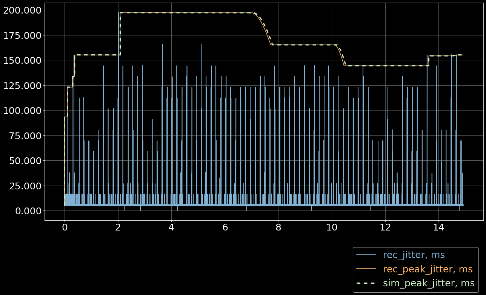
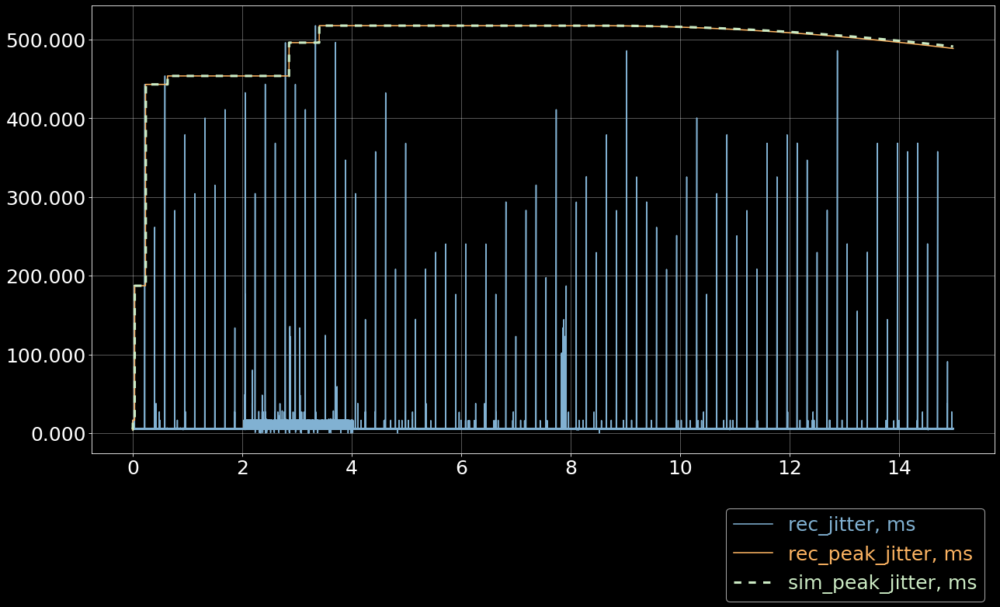
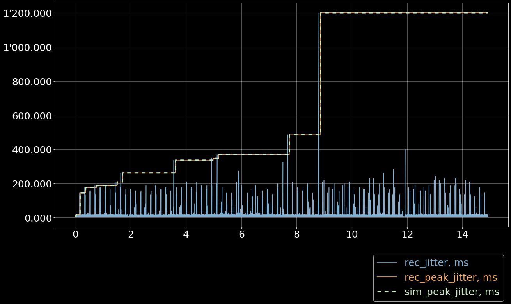
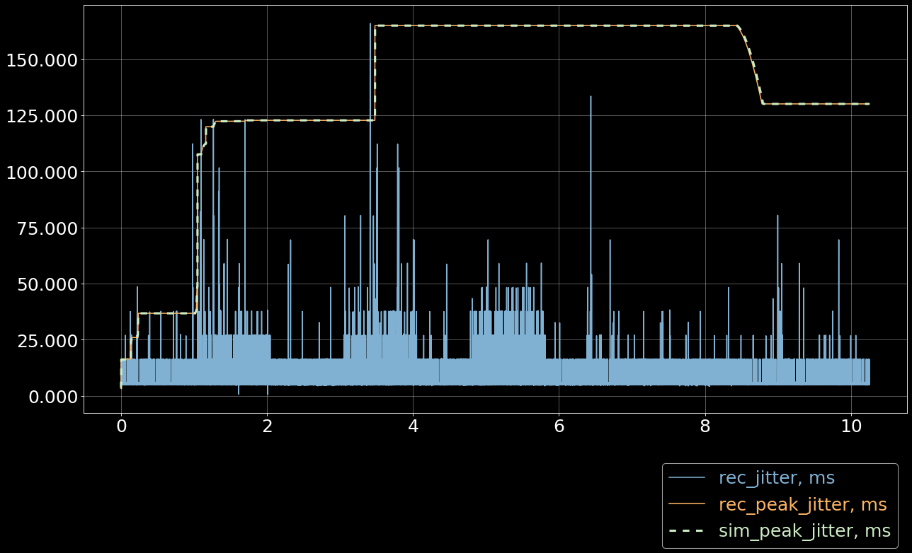

# TEST `20250214_gh712_jitter_sim`

**Table of contents:**

-   [Test summary](#test-summary)
-   [Library code](#library-code)
-   [Simulation code](#simulation-code)
-   [Case 01: 5ghz–no-load](#case-01-5ghz--no-load)
-   [Case 02: 5ghz–with-load](#case-02-5ghz--with-load)
-   [Case 03: 5+2ghz–no-load](#case-03-52ghz--no-load)
-   [Case 04: 5+2ghz–with-load](#case-04-52ghz--with-load)

# Test summary

**Test:** `20250214_gh712_jitter_sim` Simulation of peak jitter
algorithms.

**Date:**

Sat 15 Feb 2025

**Jupyter notebook:**

[`README.ipynb`](README.ipynb)

# Library code

[`library.py`](library.py)

``` python
# -*- coding: utf-8; tab-width: 2 -*-
import addict
import matplotlib.pyplot as plt
import matplotlib.ticker as ticker
import numpy as np
import os
import pandas as pd
import subprocess

plt.rcParams['figure.figsize'] = [20, 10]
plt.rcParams['figure.dpi'] = 75
plt.rcParams.update({'font.size': 24})
plt.style.use(['dark_background'])

def load_csv(path, lstrip=1, rstrip=1):
  if os.path.exists(path):
    iterator = open(path)
  else:
    iterator = (line.decode('utf-8') for line in
                subprocess.Popen(['xz', '-dc', f'{path}.xz'],
                                 stdout=subprocess.PIPE).stdout)

  contents = {}
  for line in iterator:
    key = line[0]
    if not key in contents:
      contents[key] = []
    contents[key].append(line[2:].rstrip())

  data = {}
  for key, lines in contents.items():
    if lstrip:
      lines = lines[lstrip:]
    if rstrip:
      lines = lines[:-rstrip]
    mat = np.genfromtxt(lines, dtype=float, delimiter=',')
    mat[:,0] /= 1e9
    mat[:,0] -= mat[0,0]
    data[key] = mat

  return data

def load_report(name, lstrip=1, rstrip=1):
  return load_csv(f'../20250210_gh712_peak_jitter/{name}/roc_recv.csv')

def configure_plot():
  ax = plt.gca()
  ax.grid(True, alpha=0.4)
  ax.ticklabel_format(useOffset=False, style='plain')
  ax.get_yaxis().set_major_formatter(ticker.FuncFormatter(
    lambda x, pos: "{:,.3f}".format(x).replace(",", "'")))

def plot_bars(x, y, bottom=None, offset=None, step=20/60, width=None, *args, **kw):
  if not width:
    width = step / 5

  xc = np.arange(x[0], x[-1], step)
  yc = np.zeros_like(xc)

  for i in range(len(xc)):
    yc[i] = np.sum(y[np.where((x >= xc[i]) & (x < xc[i] + step))])

  if offset is not None:
    xc += offset * width * 1.15
  if bottom is not None:
    yc += bottom

  plt.bar(xc, yc, bottom=bottom, width=width, *args, **kw)

  # can be used as bottom for another plot
  return yc

def in_notebook():
  for var in ['JPY_PARENT_PID', 'JUPYTERLAB_PATH']:
    if var in os.environ:
      return True
  return False

def hdr(s):
  s = s.replace('_', '-')
  if in_notebook():
    return s
  else:
    return f'*{s}*'

def stats_table(name, values):
  return pd.DataFrame({
    '': [hdr(name)],
    hdr('min'): ['{:.3f} ms'.format(np.min(values))],
    hdr('max'): ['{:.3f} ms'.format(np.max(values))],
    hdr('avg'): ['{:.3f} ms'.format(np.mean(values))],
    hdr('p95'): ['{:.3f} ms'.format(np.percentile(values, 95))],
  })

def jitter_table(name, values):
  values_jitter = np.abs(np.diff(np.diff(values)))
  return stats_table(name, values_jitter)

def drift_table(name, tstamps, values):
  tstamp_delta = tstamps[-1] - tstamps[0]
  values_delta = values[-1] - values[0]
  values_drift = values_delta / tstamp_delta
  return pd.DataFrame({
    '': [hdr(name)],
    hdr('sec/sec'): '{:.6f}'.format(values_drift),
    hdr('sec/day'): '{:.3f}'.format(values_drift*60*60*24),
  })

def format_tables(*tables):
  res = pd.concat(tables)
  if in_notebook():
    res.index = res.iloc[:,0].tolist()
    res = res.iloc[:, 1:]
    res = res.T
    return res
  else:
    res = res.T
    res = res.reset_index()
    tbl = res.values.tolist()
    return [tbl[0]] + [None] + tbl[1:]
```

# Simulation code

## MovStats

[`sim/mov_stats.py`](sim/mov_stats.py)

``` python
#! /usr/bin/env python3
# -*- coding: utf-8; tab-width: 2 -*-

from bisect import insort
from collections import deque
from random import randint, random
import heapq
import math
import numpy as np

class MovAvgStd:
  """
  >>> N_ITERS = 10
  >>> N_ELEMS = 1000
  >>> MIN_WINDOW = 1
  >>> MAX_WINDOW = 100
  >>> RANGES = [ (+10000000, +20000000),
  ...            (-20000000, -10000000),
  ...            (-10000000, +10000000) ]
  >>> for min_value, max_value in RANGES:
  ...   for iter in range(N_ITERS):
  ...     win_sz = randint(MIN_WINDOW, MAX_WINDOW)
  ...     comp = MovAvgStd(win_sz)
  ...     elems = np.zeros(N_ELEMS)
  ...     n_elems = 0
  ...     for n in range(N_ELEMS):
  ...       elems[n] = randint(min_value, max_value)
  ...       n_elems += 1
  ...       comp.add(elems[n])
  ...       cur_win_sz = min(win_sz, n_elems)
  ...       cur_win = elems[n_elems - cur_win_sz:n_elems]
  ...       target_avg = sum(cur_win) / cur_win_sz
  ...       target_var = sum([(x - target_avg)**2 / cur_win_sz for x in cur_win])
  ...       target_std = np.sqrt(target_var)
  ...       assert abs(target_avg - comp.mov_avg()) < 1
  ...       assert abs(target_var - comp.mov_var()) < 100
  ...       assert abs(target_std - comp.mov_std()) < 100
  """

  def __init__(self, win_len):
    self._window = deque(maxlen=win_len)
    self._sum = 0
    self._sum_squares = 0

  def mov_avg(self):
    return self._sum / len(self._window)

  def mov_var(self):
    avg = self.mov_avg()
    return self._sum_squares / len(self._window) - avg**2

  def mov_std(self):
    return np.sqrt(self.mov_var())

  def add(self, value):
    if len(self._window) == self._window.maxlen:
      old_value = self._window[0]
      self._sum -= old_value
      self._sum_squares -= old_value**2
    self._window.append(value)
    self._sum += value
    self._sum_squares += value**2

class MovMinMax:
  """
  >>> N_ITERS = 10
  >>> N_ELEMS = 1000
  >>> MIN_WINDOW = 1
  >>> MAX_WINDOW = 100
  >>> RANGES = [ (+10000000, +20000000),
  ...            (-20000000, -10000000),
  ...            (-10000000, +10000000) ]
  >>> for min_value, max_value in RANGES:
  ...   for iter in range(N_ITERS):
  ...     win_sz = randint(MIN_WINDOW, MAX_WINDOW)
  ...     comp = MovMinMax(win_sz)
  ...     elems = np.zeros(N_ELEMS)
  ...     n_elems = 0
  ...     for n in range(N_ELEMS):
  ...       elems[n] = randint(min_value, max_value)
  ...       n_elems += 1
  ...       comp.add(elems[n])
  ...       cur_win_sz = min(win_sz, n_elems)
  ...       cur_win = elems[n_elems - cur_win_sz:n_elems]
  ...       target_min = min(cur_win)
  ...       target_max = max(cur_win)
  ...       assert target_min == comp.mov_min()
  ...       assert target_max == comp.mov_max()
  """

  def __init__(self, win_len):
    self._window = deque(maxlen=win_len)
    self._min_heap = []
    self._max_heap = []

  def mov_min(self):
    return self._min_heap[0]

  def mov_max(self):
    return -self._max_heap[0]

  def add(self, value):
    self._window.append(value)
    heapq.heappush(self._min_heap, value)
    heapq.heappush(self._max_heap, -value)
    while self._min_heap[0] not in self._window:
      heapq.heappop(self._min_heap)
    while -self._max_heap[0] not in self._window:
      heapq.heappop(self._max_heap)

class MovQuantile:
  """
  >>> N_ITERS = 10
  >>> N_ELEMS = 1000
  >>> MIN_WINDOW = 1
  >>> MAX_WINDOW = 100
  >>> for iter in range(N_ITERS):
  ...   win_sz = randint(MIN_WINDOW, MAX_WINDOW)
  ...   quant = random()
  ...   comp = MovQuantile(win_sz, quant)
  ...   elems = np.zeros(N_ELEMS)
  ...   n_elems = 0
  ...   for n in range(N_ELEMS):
  ...     elems[n] = random()
  ...     n_elems += 1
  ...     comp.add(elems[n])
  ...     cur_win_sz = min(win_sz, n_elems)
  ...     cur_win = np.copy(elems[n_elems - cur_win_sz:n_elems])
  ...     cur_win.sort()
  ...     cur_win_mid = int(np.floor((cur_win_sz - 1) * quant))
  ...     expected = cur_win[cur_win_mid]
  ...     actual = comp.mov_quantile()
  ...     assert abs(expected - actual) < 0.00001
  """

  def __init__(self, win_len, quantile):
    self._quantile = quantile
    self._window = deque(maxlen=win_len)
    self._sorted = []

  def mov_quantile(self):
    if not self._sorted:
      return 0
    idx = int(self._quantile * (len(self._sorted)-1))
    return self._sorted[idx]

  def add(self, value):
    if len(self._window) == self._window.maxlen:
      old = self._window[0]
      self._window.append(value)
      self._sorted.remove(old)
      insort(self._sorted, value)
    else:
      self._window.append(value)
      insort(self._sorted, value)
```

## JitterMeter

[`sim/jitter_meter.py`](sim/jitter_meter.py)

``` python
#! /usr/bin/env python3
# -*- coding: utf-8; tab-width: 2 -*-

from dataclasses import dataclass
import numpy as np
import sys

if 'pytest' in sys.modules:
  from .mov_stats import *

@dataclass
class JitterMeterConfig:
  jitter_window: int = 50000
  envelope_smoothing_window_len: int = 10
  envelope_resistance_exponent: float = 6.0
  envelope_resistance_coeff: float = 0.1
  peak_quantile_window: int = 10000
  peak_quantile_coeff: float = 0.92

@dataclass
class JitterMetrics:
  mean_jitter: float = 0
  peak_jitter: float = 0
  curr_jitter: float = 0
  curr_envelope: float = 0

class JitterMeterA:
  """
  >>> meter = JitterMeterA()
  >>> meter.update_jitter(1000)
  >>> meter.update_jitter(1500)
  >>> meter.update_jitter(1000)
  >>> meter.metrics()
  JitterMetrics(mean_jitter=1167, peak_jitter=1500, curr_jitter=1000, curr_envelope=1500)
  """

  def __init__(self, config=None):
    if not config:
      config = JitterMeterConfig()
    self._config = config
    self._metrics = JitterMetrics()
    self._jitter_window = MovAvgStd(config.jitter_window)
    self._smooth_jitter_window = MovMinMax(config.envelope_smoothing_window_len)
    self._envelope_window = MovQuantile(config.peak_quantile_window,
                                        config.peak_quantile_coeff)
    self._peak_window = MovMinMax(config.jitter_window)
    self._capacitor_charge = 0
    self._capacitor_discharge_resistance = 0
    self._capacitor_discharge_iteration = 0

  def metrics(self):
    return self._metrics

  def update_jitter(self, jitter):
    self._jitter_window.add(jitter)

    self._smooth_jitter_window.add(jitter)
    jitter_envelope = self._update_envelope(
        self._smooth_jitter_window.mov_max(), self._jitter_window.mov_avg())

    self._envelope_window.add(jitter_envelope)
    self._peak_window.add(self._envelope_window.mov_quantile())

    self._metrics.mean_jitter = round(self._jitter_window.mov_avg())
    self._metrics.peak_jitter = round(self._peak_window.mov_max())
    self._metrics.curr_jitter = round(jitter)
    self._metrics.curr_envelope = round(jitter_envelope)

  def _update_envelope(self, cur_jitter, avg_jitter):
    if self._capacitor_charge < cur_jitter:
      self._capacitor_charge = cur_jitter
      self._capacitor_discharge_resistance = math.pow(
        cur_jitter / avg_jitter,
        self._config.envelope_resistance_exponent) * self._config.envelope_resistance_coeff
      self._capacitor_discharge_iteration = 0
    elif self._capacitor_charge > 0:
      self._capacitor_charge *= math.exp(
        -self._capacitor_discharge_iteration / self._capacitor_discharge_resistance)
      self._capacitor_discharge_iteration += 1
    if self._capacitor_charge < 0:
      self._capacitor_charge = 0
    return self._capacitor_charge

def sim_jitter_meter(algo, jitter):
  jm = algo()

  peak_jitter = np.zeros_like(jitter)
  for i in range(len(jitter)):
    jm.update_jitter(jitter[i])
    peak_jitter[i] = jm.metrics().peak_jitter

  return peak_jitter
```

## PyTest

``` shell
pytest -v --no-header --doctest-modules sim
```

``` example
============================= test session starts ==============================
collecting ... collected 4 items

sim/jitter_meter.py::sim.jitter_meter.JitterMeterA PASSED                [ 25%]
sim/mov_stats.py::sim.mov_stats.MovAvgStd PASSED                         [ 50%]
sim/mov_stats.py::sim.mov_stats.MovMinMax PASSED                         [ 75%]
sim/mov_stats.py::sim.mov_stats.MovQuantile PASSED                       [100%]

============================== 4 passed in 0.74s ===============================
```

# Case 01: `5ghz--no-load`

``` python
data = load_report('01--5ghz--no_load')

rep = addict.Dict()
rep.timestamp = data['m'][:,0]
rep.rec_jitter = data['m'][:,2]
rep.rec_peak_jitter = data['m'][:,3]
rep.sim_peak_jitter = sim_jitter_meter(JitterMeterA, rep.rec_jitter)

rep1 = rep
```

``` python
plt.plot(rep1.timestamp/60, rep1.rec_jitter/1e6, 'C4')
plt.plot(rep1.timestamp/60, rep1.rec_peak_jitter/1e6, 'C5')
plt.plot(rep1.timestamp/60, rep1.sim_peak_jitter/1e6, 'C8',
         linewidth=3, linestyle=(0, (3, 3)))
plt.legend(['rec_jitter, ms', 'rec_peak_jitter, ms', 'sim_peak_jitter, ms'],
           labelcolor='linecolor', bbox_to_anchor=(1, -0.1))
configure_plot()
```



# Case 02: `5ghz--with-load`

``` python
data = load_report('02--5ghz--with_load')

rep = addict.Dict()
rep.timestamp = data['m'][:,0]
rep.rec_jitter = data['m'][:,2]
rep.rec_peak_jitter = data['m'][:,3]
rep.sim_peak_jitter = sim_jitter_meter(JitterMeterA, rep.rec_jitter)

rep2 = rep
```

``` python
plt.plot(rep2.timestamp/60, rep2.rec_jitter/1e6, 'C4')
plt.plot(rep2.timestamp/60, rep2.rec_peak_jitter/1e6, 'C5')
plt.plot(rep2.timestamp/60, rep2.sim_peak_jitter/1e6, 'C8', 
         linewidth=3, linestyle=(0, (3, 3)))
plt.legend(['rec_jitter, ms', 'rec_peak_jitter, ms', 'sim_peak_jitter, ms'],
           labelcolor='linecolor', bbox_to_anchor=(1, -0.1))
configure_plot()
```



# Case 03: `5+2ghz--no-load`

``` python
data = load_report('03--5+2ghz--no_load')

rep = addict.Dict()
rep.timestamp = data['m'][:,0]
rep.rec_jitter = data['m'][:,2]
rep.rec_peak_jitter = data['m'][:,3]
rep.sim_peak_jitter = sim_jitter_meter(JitterMeterA, rep.rec_jitter)

rep3 = rep
```

``` python
plt.plot(rep3.timestamp/60, rep3.rec_jitter/1e6, 'C4')
plt.plot(rep3.timestamp/60, rep3.rec_peak_jitter/1e6, 'C5')
plt.plot(rep3.timestamp/60, rep3.sim_peak_jitter/1e6, 'C8', 
         linewidth=3, linestyle=(0, (3, 3)))
plt.legend(['rec_jitter, ms', 'rec_peak_jitter, ms', 'sim_peak_jitter, ms'],
           labelcolor='linecolor', bbox_to_anchor=(1, -0.1))
configure_plot()
```



# Case 04: `5+2ghz--with-load`

``` python
data = load_report('04--5+2ghz--with_load')

rep = addict.Dict()
rep.timestamp = data['m'][:,0]
rep.rec_jitter = data['m'][:,2]
rep.rec_peak_jitter = data['m'][:,3]
rep.sim_peak_jitter = sim_jitter_meter(JitterMeterA, rep.rec_jitter)

rep4 = rep
```

``` python
plt.plot(rep4.timestamp/60, rep4.rec_jitter/1e6, 'C4')
plt.plot(rep4.timestamp/60, rep4.rec_peak_jitter/1e6, 'C5')
plt.plot(rep4.timestamp/60, rep4.sim_peak_jitter/1e6, 'C8', 
         linewidth=3, linestyle=(0, (3, 3)))
plt.legend(['rec_jitter, ms', 'rec_peak_jitter, ms', 'sim_peak_jitter, ms'],
           labelcolor='linecolor', bbox_to_anchor=(1, -0.1))
configure_plot()
```


